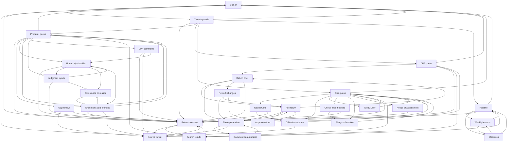

# Navigation

The service navigation by role, the identity bar, where each control leads, what Back does and the keyboard shortcuts. Screen names are those in `screens.md`.

## Service navigation by role

The GOV.UK service navigation sits under the header on every screen and shows only what the role may open (SEC-2). Sign out is its last item. Search is the box in the header on every screen (key `s`), not a navigation item. There is no Today page (A485).

- Preparer: My returns (Preparer queue).
- Ops: Ops queue, New returns.
- CPA: Review queue (CPA queue), Preparer queue, Ops queue, New returns, Board. The CPA sees everything.
- Owner: Board (Pipeline, Weekly lessons, Measures), Review queue, Preparer queue, Ops queue, New returns. The owner sees everything.
- After sign-in a person lands on the page they asked for, else on their own list: preparer Preparer queue, CPA CPA queue, ops Ops queue, owner Pipeline.
- Inside a return, every role sees the same record tabs: Overview, Workbench, Review, Documents, Exceptions, History, Ops (Z20-6; the approved record, version A, Z20-1). Each role lands on its own tab: the preparer on Workbench, the CPA on Review, ops and the owner on Overview (A387, A485).

## Identity bar

The MOJ identity bar sits on every return screen: the corporation name and year end first, then state and tier as tags with words, the waiting-on-client flag or a Blocked tag when either applies, the filing due date and balance-due date, the hold in words (not held, held by you until a time, held by another with the time it ends, or ended), and a button menu for the actions that role can take (take or release the hold, record a chase). It is the same on every return screen for every role (RV-50), and an "approved" or "approval void" alert appears under it when FLOW-5 applies.

## Back

Back always returns to the list you came from, with its filter, sort and scroll kept (staff-screens rule 21). Next and previous follow that list. Opening a source adds no history entry, so Back skips it. A save or an action stays on the list, moves focus to the result or next row and announces it. The Back column below names the usual screen.

## Links

| From | Control | Leads to | Back goes to |
| --- | --- | --- | --- |
| Sign in | Continue | Two-step code | Sign in |
| Two-step code | Verify | Return overview | Sign in |
| Two-step code | Back | Sign in | Sign in |
| Search results | Open return | Return overview | Search results |
| Search results | Sign out | Sign in | Sign in |
| Return overview | Open source | Source viewer | Return overview |
| Return overview | Search | Search results | Return overview |
| Return overview | Sign out | Sign in | Sign in |
| Source viewer | Next source | Source viewer | Return overview |
| Source viewer | Previous source | Source viewer | Return overview |
| Source viewer | Close source | Return overview | Return overview |
| Preparer queue | Open return | Return overview | Preparer queue |
| Preparer queue | Gap review | Gap review | Preparer queue |
| Preparer queue | Round trip | Round trip checklist | Preparer queue |
| Preparer queue | Exceptions | Exceptions and orphans | Preparer queue |
| Preparer queue | CPA comments | CPA comments | Preparer queue |
| Preparer queue | Judgment inputs | Judgment inputs | Preparer queue |
| Preparer queue | Search | Search results | Preparer queue |
| Preparer queue | Sign out | Sign in | Sign in |
| Gap review | Open source | Source viewer | Gap review |
| Gap review | Sign question list | Preparer queue | Gap review |
| Gap review | Overview | Return overview | Preparer queue |
| Round trip checklist | Overview | Return overview | Preparer queue |
| Judgment inputs | Overview | Return overview | Preparer queue |
| Exceptions and orphans | Overview | Return overview | Preparer queue |
| CPA comments | Overview | Return overview | Preparer queue |
| Round trip checklist | Judgment inputs | Judgment inputs | Round trip checklist |
| Round trip checklist | Cite | Cite source or reason | Round trip checklist |
| Round trip checklist | Exceptions | Exceptions and orphans | Round trip checklist |
| Judgment inputs | Cite | Cite source or reason | Judgment inputs |
| Judgment inputs | Round trip | Round trip checklist | Judgment inputs |
| Exceptions and orphans | Cite | Cite source or reason | Exceptions and orphans |
| Exceptions and orphans | Open source | Source viewer | Exceptions and orphans |
| Exceptions and orphans | Sign and send to review | Preparer queue | Exceptions and orphans |
| Cite source or reason | Save citation | Exceptions and orphans | Exceptions and orphans |
| Cite source or reason | Cancel | Exceptions and orphans | Exceptions and orphans |
| CPA comments | Open source | Source viewer | CPA comments |
| CPA comments | Approve draft fix | Round trip checklist | CPA comments |
| CPA comments | Sign and send to review | Preparer queue | CPA comments |
| CPA queue | Review return | Return brief | CPA queue |
| CPA queue | Open return | Return overview | CPA queue |
| CPA queue | Search | Search results | CPA queue |
| CPA queue | Sign out | Sign in | Sign in |
| Return brief | Full return | Full return | Return brief |
| Return brief | Open flag | Three-pane view | Return brief |
| Return brief | See changed cells | Rework changes | Return brief |
| Return brief | Overview | Return overview | CPA queue |
| Full return | Open number | Three-pane view | Full return |
| Full return | Next flag | Full return | Return brief |
| Full return | Next number | Full return | Return brief |
| Full return | Reviewed, next | Full return | Return brief |
| Full return | Approve | Approve return | Full return |
| Full return | Brief | Return brief | CPA queue |
| Three-pane view | Next flag | Three-pane view | Full return |
| Three-pane view | Previous flag | Three-pane view | Full return |
| Three-pane view | Next number | Three-pane view | Full return |
| Three-pane view | Reviewed, next | Three-pane view | Full return |
| Three-pane view | Comment | Comment on a number | Three-pane view |
| Three-pane view | Open source | Source viewer | Three-pane view |
| Three-pane view | Back to full return | Full return | Full return |
| Comment on a number | Send to preparer | Three-pane view | Three-pane view |
| Comment on a number | Cancel | Three-pane view | Three-pane view |
| Rework changes | Open number | Three-pane view | Rework changes |
| Rework changes | Full return | Full return | Return brief |
| Rework changes | Approve | Approve return | Rework changes |
| Approve return | Confirm approval | CPA queue | Full return |
| Approve return | Unmarked section | Full return | Approve return |
| Ops queue | New returns | New returns | Ops queue |
| Ops queue | CRA data capture | CRA data capture | Ops queue |
| Ops queue | T183CORP | T183CORP | Ops queue |
| Ops queue | Check export | Check export upload | Ops queue |
| Ops queue | Filing confirmation | Filing confirmation | Ops queue |
| Ops queue | Notice of assessment | Notice of assessment | Ops queue |
| Ops queue | Open return | Return overview | Ops queue |
| Ops queue | Search | Search results | Ops queue |
| Ops queue | Sign out | Sign in | Sign in |
| New returns | Start CRA capture | CRA data capture | New returns |
| New returns | Open return | Return overview | New returns |
| CRA data capture | Open source | Source viewer | CRA data capture |
| CRA data capture | Save capture | Ops queue | CRA data capture |
| T183CORP | Upload certificate | Ops queue | T183CORP |
| Check export upload | Upload check export | Filing confirmation | Check export upload |
| Check export upload | Open return | Return overview | Check export upload |
| Filing confirmation | Save confirmation number | Ops queue | Filing confirmation |
| Notice of assessment | Save notice | Ops queue | Notice of assessment |
| Notice of assessment | Open return | Return overview | Notice of assessment |
| Pipeline | Weekly lessons | Weekly lessons | Pipeline |
| Pipeline | Measures | Measures | Pipeline |
| Pipeline | Open return | Return overview | Pipeline |
| Pipeline | Search | Search results | Pipeline |
| Pipeline | Sign out | Sign in | Sign in |
| Weekly lessons | Pipeline | Pipeline | Pipeline |
| Weekly lessons | Measures | Measures | Pipeline |
| Measures | Pipeline | Pipeline | Pipeline |
| Measures | Weekly lessons | Weekly lessons | Pipeline |

The Approve control appears only when every section is marked (RV-10); until then the Full return screen lists the unmarked sections as links, and the Unmarked section control leads to them. Sign out (service navigation) and Search (header) are on every screen and are listed once from the screens where the work starts. After Verify a person lands on the asked-for address if there is one (any screen they may see, shown here as Return overview), else on their own list: preparer Preparer queue, CPA CPA queue, ops Ops queue, owner Pipeline (Entry points). A session that ends (30 minutes idle, 12 hours in all) sends the next request on any screen to Sign in with the asked-for address kept; after the code the person lands there with the selection restored from the URL.

## Entry points

| Role | Screen |
| --- | --- |
| preparer | Preparer queue |
| ops | Ops queue |
| ops | New returns |
| cpa | CPA queue |
| cpa | Preparer queue |
| cpa | Ops queue |
| cpa | Pipeline |
| owner | Pipeline |
| owner | CPA queue |
| owner | Preparer queue |
| owner | Ops queue |

## Shortcuts

One list for the whole app. Every shortcut repeats a visible control, is a single key with no modifier, avoids keys owned by browsers and screen readers, carries `aria-keyshortcuts`, does nothing while focus is in a text field and can be turned off (WCAG 2.1.4). A key never unmarks, approves, sends or deletes: it moves focus to the control, and the person presses it (rule 22). The list shows under a details control named Keyboard shortcuts on every review page.

| Key | Control it repeats | Screen |
| --- | --- | --- |
| `n` | Next flag | Full return |
| `m` | Next number | Full return |
| `o` | Open number | Full return |
| `r` | Reviewed, next | Full return |
| `a` | Approve | Full return |
| `n` | Next flag | Three-pane view |
| `p` | Previous flag | Three-pane view |
| `m` | Next number | Three-pane view |
| `o` | Open source | Three-pane view |
| `c` | Comment | Three-pane view |
| `r` | Reviewed, next | Three-pane view |
| `]` | Next source | Source viewer |
| `[` | Previous source | Source viewer |
| `s` | Search | all |

## Flow diagram

